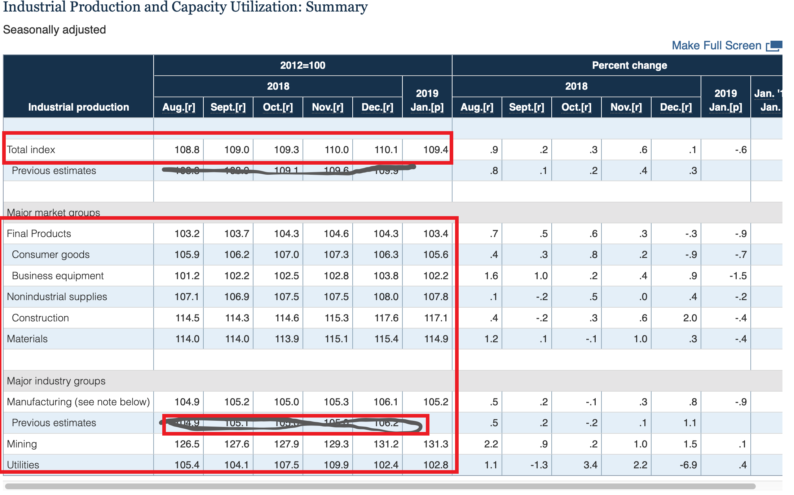

```{r setup, include=FALSE}
knitr::opts_chunk$set(echo = TRUE)
library(tidyverse)
library(lubridate)
```
# Overview: Federal Reserve Industrial Production

The United States Federal Reserve System ("the Fed") publishes statistical data about the economy as part of its overall mission to supervise and regulate monetary policy, the banking system and monitor economic conditions.
One such statistical publication is the G17 statistical release about Industrial Production and Capacity Utilization.  Released monthly since 1947 by the Fed, the G17 data set is a critical information source for global financial markets, central banks and economists.

This project component identifies how to source and prepare one key table of the G17 release for data analysis and modeling.

The document proceeds as follows.  We first explain the data set and its intrinsic features and complexities.
Then, we propose a data model and wrangle the input file to populate the database table.
Third, we run basic exploratory data analysis to glean basic facts.

## Overview of the Industrial Production Data

The G17 statistical release has a vast amount of data.  This project's focus is the first table:  the Industrial Production Summary table.   An example is illustrated below in a screenshot.

```{r industrial-screenshot, echo=FALSE , fig.cap="G17 Industrial Production Summary table" }

```

The above image has been marked up to identify the data element we wish to import.
In particular, we are choosing to exclude previous estimates and percent changes in values.
Previous estimates and percent changes are excluded because they are redundant.
Only data circled in red is in scope for the project.

The actual data will be parsed from an ASCII file named "g17.txt" that was downloaded from:

The data source of the ASCII file is [https://www.federalreserve.gov/releases/g17/Current/g17.txt]


There are several complications worth noting below

### Data and Format Is Revised Over Time

The G17 data is published monthly with a 6 month lookback period.  During this lookback period, the same prior month's data may be revised up to 6 times.  This is because industrial production data is revised due to variation in survey response time by participating firms.  For each production figure for a given period, the first observation is called *preliminary* while later ones are called *revised*.  The final revision occurs 6 months after the *preliminary* observation.


In the example below, we will see that the Oct 2018 Industrial Production figure is revised three times between Dec 2018 release to Feb 2019 release.  The value changes from 108.7 to 109.1 to 109.3.  Moreover, notice the columm position of the Oct 2018 figure shifts each month by one column to the left
since data is displayed on a six month rolling window.

Here is an example of the revision process for 3 consecutive months:


```{r dec2018-g17, echo=FALSE , fig.cap="Dec 2018-Feb 2019 G17 Summary" }
knitr::include_graphics("Dec2018_G17.png")
knitr::include_graphics("Jan2019_G17.png")
knitr::include_graphics("Feb2019_G17.png")


```


### File Contains Extraneous Data

The file contains numerous tables and extraneous text.  Moreover, the rows of the file containing the relevant data and show the month-over-month changes in the Industrial production values.  For clarity, in the Feb 2019 release, the Jan change is calculated by comparing the latest available Dec 2018 data to the latest Jan 2019 to get a relative return.

Some rows contain previous estimates from the prior month.  These datum are ignored.

Moreover, the release date of the file is provided on line 4 whereas the data table is much later.

### Additional Details are grouped Hierarchically

The industrial production data is released for a variety of industries within the economy.   These  include:

0) Total index
1) Final Products
2) Consumer goods
3) Business equipment
4) Nonindustrial supplies
5) Construction
6) Materials
7) Manufacturing
8) Mining
9) Utilities

We will store the time series data for all of these industries.

## Defining Tidy Data

Tidy data requires clearly defining an observation.
It requires ensuring each column is a variable and each row is an observation.

In this case, we define each observation as being comprised of:

* an industry group (either Total Index, Final Products, Consumer goods, etc.)
* production period (the month/year for which production data is surveyed)
* release date (the date on which a given version of the value is released)
* index level ( a value representing the level of industrial production relative to the baseline year 2012)


## Location of the Data Files

We will only parse and import the G17 file released as of February 15, 2019.

```{r}
library(readr)

urlFile = "https://raw.githubusercontent.com/completegraph/607_DATAAcquisition/master/g17.txt"
lines <- readLines(urlFile)


str(lines)

```

## Wrangling the Data File

The useful information in the file has two parts: the release date near the top and the data table near line 70.

First, the release date is located on line 4 as the text string:  February 15, 2019
We use it to identify the production dates.  These would be the month-end dates of the production periods.
Since the statistical releases are revised 6 times for a given production period, we see 6 prior month ends.
For the February release, the production months range start on August 31, 2018 and end on Jan 31, 2019.

```{r}

# The release date is found on the fourth row  %B = full name month  %d 2 digit day  %Y 4 digit year
(release_date = parse_date(str_trim(lines[4] ), "%B %d, %Y" ) )

# Last 6 prior month-ends:  rollback provides the month-end.  
# lubridate does the normal date arithmetics
# since release dates are mid-month.   
# rollback is vectorized and gives the month-end prior to the input dates.
# rev does a reverse sort to put dates in increasing chronological order.
#
production_date = rev( rollback( release_date - months(0:5 )) )
```


The data table can be identified by its title which exists on a line alone.
Its position varies with each release but the relative position and format of the data table is fixed relative to the title.
Moreover, the industry groups for which data is required are constant.
We hard-code their offset positions relative to the title as we parse the relevant lines.

```{r}
# Row where the title of the table is found.
( first_match = which(str_detect( lines, "Industrial Production and Capacity Utilization:  Summary" ) ) )


offsets = c( 9, 13, 14, 15, 16, 17, 18, 21, 23, 24 )

# Allocate a matrix of zeros of the size to hold the industrial production index levels.
# ----------------------------------------------------------------------------------------
mm = matrix( rep(0, length(offsets)* 6), nrow=length(offsets), ncol=6)

# Allocate the industry names to a character vector.
industries = as.character(length(offsets))

idx = 0

for( offset in offsets )
{
  idx=idx+1

  # Useful row index is defined by first_match + offset
  index_row = first_match + offset

  # Split the industry text and the six months of industrial figures by pipe delimiter
  lines_parts = str_trim( unlist(  str_split( lines[ index_row ], "\\|")  ) )

  # extract the industry name
  industries[idx] = unlist( lines_parts[1] )
  
  # strip off the parenthetical note on one industry name
  industries[idx] = str_replace( industries[idx], "\\s*\\(.*\\)", "" )

  # get the vector of numerical figures
  figures = as.double( unlist( str_extract_all( lines_parts[2], "\\d+\\.\\d+") ) ) 

  # store a row into the matrix
  mm[idx,] = figures
}

# Transpose the matrix to have industries as columns.
# There are 6 rows.
df = as_tibble(t(mm))

colnames(df) <- industries

# Add the production dates and the release date into the dataframe.
df = add_column( df, production_date = production_date)
df = add_column( df, revision_date = rep(release_date, 6))

knitr::kable( df)

```

The last step is to make the data tidy and consistent with the format we are going to use to do analysis.
Gather the staged dataframe and store the industrial production index levels into a column called: **production**.
Store the industry group names under a column called **IndustryGroup**.

```{r}

tidydata = gather(df, key="industry_group", value="production", `Total index`:`Utilities`)

knitr::kable(head(tidydata,10))

```

## Exploratory Data Analysis

```{r}

ggplot(tidydata) + 
  geom_line( mapping=aes(x=production_date, y = production, color=industry_group), size=1.5) + 
  facet_wrap(~industry_group) + theme(legend.position = "none") +
  ggtitle("Industrial Production for Feb 2019")

```

Let us explore the monthly returns of each industry group's industrial production function.
Changes in Industrial Production are important for economists to detect early signs of recession or boom in the US economy.
To do this, we calculate monthly lagged returns using **mutate** with the **lag** function.

Note that we filter out the August production figure because we cannot plot returns of the earliest production period.
However, since our goal is to visualize the recent production months, that should be fine.

The below bar plots show returns by IndustryGroup.  We see that industrial production decline in the most recent period for 7 industry groups and rose for 3.

```{r}

tidydata %>% 
  group_by(industry_group) %>% 
  mutate( ret = production / lag(production) - 1.0 ) %>% 
  filter( !is.na(ret)) -> trends


ggplot(trends) + 
  geom_bar( stat="identity", mapping=aes(x=production_date, y = ret, 
                                         fill=industry_group), size=1.0) + 
  facet_wrap(~industry_group) + theme(legend.position = "none") +
  ggtitle("Industrial Production Returns as of Feb 2019")
```

## Exporting the Data to SQL

We created a database table for the production figures in MySQL called *industrialproduction*.
However, we will not store the returns because this requires access to the previous month's data to calculate returns
for the earliest period.  Instead, returns should be calculated within MySQL after production figures are imported.

First, we write the tidydata to csv.

```{r}
write_csv(tidydata, path="./Industrial_Production_Feb2019.csv" )

```

Second, we import the local file with MySQL import wizard and display the results from MySQL Workbench.

```{r}
knitr::include_graphics("Industrial_Production_MySQL.png")

```

## Conclusion

This study illustrates the use of tidy data principles for a well known financial data set.   The source data is clean but highly non-tidy.
There are a few files to be reviewed:

* RMD file is on Github
* HTML report in on RPUBS
* Raw G17 File in on Github
* Generated Flat File for Import to database is on Github
* MySQL scheme for the target table in on Github.


